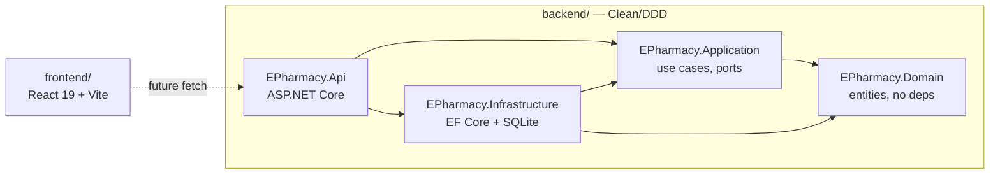

# Implementation Plan: 01 — Scaffold full-stack skeleton

## Story

**As** the delivery team,
**I want** a working React 19/Vite frontend and a .NET 10 Clean/DDD backend skeleton with SQLite wired up and tested,
**so that** upcoming e-pharmacy feature stories have a real, conventions-following codebase to plan and implement against.

Acceptance criteria: see `docs/stories/01-scaffold-fullstack-skeleton.md`.

## Context

Repository currently contains only the Gen-e2 workflow scaffold (`.github/skills`, `.github/agents`, `.github/extensions`, root `package.json`/`README.md`/`scripts/validate-repository.mjs`). No frontend, no backend, no `docs/` existed before this plan. `.github/copilot-instructions.md` and `docs/definition-of-done.md` were created ahead of this plan (Phase A) to give this and all future plans a stack/convention reference, per the `implementation-plan` skill's Step 2.

Decisions carried in from user Q&A: monorepo layout, React 19 + Vite + JavaScript (no TS) frontend, .NET 10 Clean/DDD backend, SQLite (dev-only) persistence, npm as package manager, xUnit/Vitest as test frameworks.

## Approach

Scaffold both apps independently, side by side under the repo root, so each can be built/tested/run without the other. The frontend is a standard Vite `react` (JS) template — no framework customization needed at this stage since there is no UI to build yet; the enabler story only proves the toolchain (dev server, build, lint, test) works.

The backend follows Clean/DDD layering because feature work (catalog, cart, prescriptions, orders) will need clear separation between business rules (Domain), orchestration (Application), and technical concerns (Infrastructure/Api) — this is cheapest to establish now, before any real logic exists, rather than retrofitted later. Dependency direction is strict: `Api → Application → Domain`, `Infrastructure → Application/Domain`; `Domain` has zero project references. SQLite is chosen for local/dev friction-free setup (no server to run); it's flagged everywhere as dev-only so it doesn't quietly become a production decision.

A trivial `HealthCheck` entity/endpoint round-trip (not a real domain concept) is used to prove the full stack — Api → Application → Infrastructure → EF Core → SQLite — is wired correctly end-to-end, without inventing e-pharmacy domain logic that hasn't been discovered yet.

## Architecture

```
repo/
├─ frontend/                      React 19 + Vite (JS)
│  └─ src/
│     ├─ components/
│     ├─ pages/
│     └─ api/
├─ backend/
│  ├─ EPharmacy.sln
│  ├─ src/
│  │  ├─ EPharmacy.Domain/            (no project references)
│  │  ├─ EPharmacy.Application/       → Domain
│  │  ├─ EPharmacy.Infrastructure/    → Application, Domain
│  │  └─ EPharmacy.Api/               → Application, Infrastructure
│  └─ tests/
│     ├─ EPharmacy.Domain.Tests/
│     ├─ EPharmacy.Application.Tests/
│     └─ EPharmacy.Api.Tests/
├─ docs/
│  ├─ stories/01-scaffold-fullstack-skeleton.md
│  ├─ implementation-plans/01-scaffold-fullstack-skeleton.md
│  └─ definition-of-done.md
└─ .github/copilot-instructions.md
```



Key contracts established by this plan:

```csharp
// backend/src/EPharmacy.Domain/HealthCheck.cs
public sealed class HealthCheck
{
    public Guid Id { get; }
    public DateTimeOffset CheckedAtUtc { get; }
}
```

```csharp
// backend/src/EPharmacy.Application/IHealthCheckRepository.cs
public interface IHealthCheckRepository
{
    Task<HealthCheck> RecordAsync(CancellationToken ct);
}
```

```csharp
// backend/src/EPharmacy.Api/Program.cs (shape only)
app.MapGet("/health", async (IHealthCheckRepository repo, CancellationToken ct) => ...);
```

## File Changes

- [x] `.github/copilot-instructions.md` — repo conventions (stack, layout, testing, DoD pointer)
- [x] `docs/definition-of-done.md` — quality gate
- [x] `docs/stories/01-scaffold-fullstack-skeleton.md` — this story
- [x] `docs/implementation-plans/01-scaffold-fullstack-skeleton.md` — this plan
- [x] `frontend/` — Vite React 19 JS app (created via `npm create vite@latest`)
- [x] `frontend/vite.config.js` — Vitest + jsdom + RTL setup (`test` block added to Vite config, `src/setupTests.js`)
- [x] `frontend/src/components/HealthBanner.jsx` + test — smoke component
- [x] `backend/EPharmacy.sln`
- [x] `backend/src/EPharmacy.Domain/EPharmacy.Domain.csproj` + `HealthCheck.cs`
- [x] `backend/src/EPharmacy.Application/EPharmacy.Application.csproj` + `IHealthCheckRepository.cs` + `RecordHealthCheckHandler.cs`
- [x] `backend/src/EPharmacy.Infrastructure/EPharmacy.Infrastructure.csproj` + `AppDbContext.cs` + `HealthCheckRepository.cs` + `Migrations/`
- [x] `backend/src/EPharmacy.Api/EPharmacy.Api.csproj` + `Program.cs` + `appsettings.json`
- [x] `backend/tests/EPharmacy.Domain.Tests/` + `HealthCheckTests.cs`
- [x] `backend/tests/EPharmacy.Application.Tests/` (mocked repository) + `RecordHealthCheckHandlerTests.cs`
- [x] `backend/tests/EPharmacy.Api.Tests/` + `HealthEndpointTests.cs` (`WebApplicationFactory`)
- [x] `README.md` — monorepo layout + run instructions
- [x] `.gitignore` — `node_modules/`, `backend/**/bin/`, `backend/**/obj/`, `*.db`, editor/OS files

## Task Breakdown

1. [x] Scaffold `frontend/` with Vite's `react` (JavaScript) template; remove template boilerplate not needed; add `src/components/` folder (`src/pages/`, `src/api/` deferred until real feature stories need them).
2. [x] Add Vitest + React Testing Library to `frontend/`; configure `vite.config.js` test block and `src/setupTests.js`; add one smoke test (`HealthBanner`).
3. [x] Create `backend/EPharmacy.sln` and the four `src/` projects with correct project references (Domain has none).
4. [x] Implement `HealthCheck` domain type and `IHealthCheckRepository` port (+ `RecordHealthCheckHandler`) in Domain/Application.
5. [x] Implement `AppDbContext` (EF Core + SQLite) and `HealthCheckRepository` in Infrastructure; add initial migration (`InitialCreate`).
6. [x] Wire `EPharmacy.Api`: DI registration, `GET /health` minimal-API endpoint, `appsettings.json` SQLite connection string (dev file, gitignored), auto-migrate on startup.
7. [x] Create the three backend test projects; write one passing test per layer (`Domain.Tests`, `Application.Tests` with a mocked repository, `Api.Tests` via `WebApplicationFactory` hitting `/health`).
8. [x] Update root `README.md` and `.gitignore` for the new monorepo layout.
9. [x] Run full Definition of Done: `dotnet build`/`dotnet test` (5/5 passed), `npm run build`/`npm run lint`/`npm run test` (2/2 passed), confirmed `/health` responds 200 via manual `dotnet run` + `curl`, confirmed `node scripts/validate-repository.mjs` still passes.

## Commit Plan

| Tasks | Commit message | Hash |
|-------|----------------|------|
| — | `docs(gen-e2): add repo conventions and definition of done` | |
| — | `docs(gen-e2): add scaffold story and implementation plan` | |
| 1–2 | `feat(frontend): scaffold Vite React 19 app with Vitest/RTL` | |
| 3–6 | `feat(backend): scaffold .NET 10 Clean/DDD skeleton with EF Core SQLite` | |
| 7 | `test(backend): add per-layer smoke tests` | |
| 8 | `docs: document monorepo layout in README` | |

## Acceptance Criteria Mapping

| AC | Task(s) |
|----|---------|
| Frontend builds, runs, lints, has passing example test | 1, 2 |
| Backend solution with Clean/DDD layered projects | 3, 4 |
| EF Core + SQLite with initial migration | 5 |
| `GET /health` returns 200 | 6 |
| Per-layer xUnit test projects with passing tests | 7 |
| Conventions/DoD files exist | (done ahead of task 1, Phase A) |
| `validate-repository.mjs` still passes | 9 |

## Testing Strategy

| Acceptance criterion | Observable seam | Cheapest proving layer | Approach | Pipeline cadence |
| --- | --- | --- | --- | --- |
| `HealthCheck` domain type behaves correctly | `HealthCheck` public constructor/properties | Domain unit | Test-first | Every PR |
| `IHealthCheckRepository` orchestration | Application service using a mocked port | Application unit | Test-first | Every PR |
| EF Core + SQLite persists a `HealthCheck` row | `AppDbContext` against a real SQLite file/in-memory | Integration | Test-alongside | Every PR |
| `GET /health` returns 200 with a body | HTTP request via `WebApplicationFactory` | API functional | Test-alongside | Every PR |
| Frontend smoke component renders | Rendered DOM via React Testing Library, query by role/text | Component | Test-alongside | Every PR |

No E2E suite yet — there is no user journey to test until feature stories exist. Full stack wiring is proven by the API functional test instead of a browser-driven E2E test, per the "no E2E for logic/wiring" rule.

## Dependencies

None — this plan is the first thing built in the repository.

## Open Questions

None blocking. Deferred to later stories: production persistence choice (SQLite is dev-only), authentication approach, and the actual e-pharmacy feature brief (catalog, cart, prescriptions, orders, admin) needed to run `generate-stories` next.
