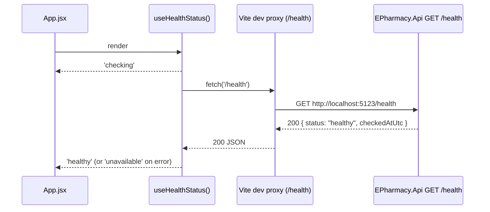

# Implementation Plan: 02 — Wire frontend shell to display e-Pharmacy health status

## Story

**As** a user opening the e-Pharmacy app,
**I want** the frontend to show real e-Pharmacy content instead of the default Vite/React starter template,
**so that** the running app reflects the actual product instead of the scaffold it was generated from.

Acceptance criteria: see `docs/stories/02-wire-frontend-health-banner.md`.

## Context

`frontend/src/App.jsx` still contains the unmodified `npm create vite` template (hero image, counter button, `#docs`/`#social` link sections) — confirmed by reading the file. `frontend/src/components/HealthBanner.jsx` already exists from story 01 (`<div role="status">Backend status: {status}</div>`, defaults to `'unknown'`) with a passing test (`HealthBanner.test.jsx`), but nothing imports it. `frontend/src/api/` does not exist yet — plan 01 reserved that path for when a real feature needed it; this story is the first to need it.

Backend contract, read from `backend/src/EPharmacy.Api/Program.cs` and `HealthEndpointTests.cs`: `GET /health` returns `200 OK` with JSON body `{ "status": "healthy", "checkedAtUtc": "<ISO-8601>" }`. No CORS middleware is registered on the API. The backend's `http` launch profile (`Properties/launchSettings.json`) binds to `http://localhost:5123`; the frontend dev server (`vite`) binds to `http://localhost:5173`.

Per `.github/copilot-instructions.md`: frontend stays JavaScript-only, tests use Vitest + React Testing Library querying by role/text, no snapshot-only tests. Per the `testing-strategy` skill, frontend network-boundary behavior belongs at the "Integration" layer with mocked handlers aligned to the published contract; component tests cover loading/empty/error/success states.

## Approach

Cross-origin calls from `:5173` to `:5123` would need either CORS on the backend or a dev proxy on the frontend. A Vite dev-server proxy (`server.proxy` in `vite.config.js`) is the cheaper, dev-only choice — it keeps the backend free of a CORS policy that would otherwise need to be revisited for every future frontend origin, mirrors the existing "SQLite is dev-only" pattern of flagging dev conveniences explicitly, and means the frontend can call the same relative path (`/health`) in dev and (once a real API base URL exists) in production.

Fetching is isolated behind a small custom hook (`src/api/useHealthStatus.js`) rather than inlined in `App.jsx`, so the component stays declarative and the network logic is unit-testable on its own with a mocked `fetch` — no new test dependency (e.g. MSW) is justified yet for a single GET endpoint; this is called out as a deliberate, revisitable choice once more endpoints exist. The hook exposes a single status string (`'checking'` while in flight, `'unavailable'` on any failure, or the backend's own `status` value on success) so it can be passed straight into the existing, already-tested `HealthBanner` without modifying that component.

`App.jsx` is rewritten to drop the Vite starter markup entirely and render a minimal e-Pharmacy shell (header + `HealthBanner`) — intentionally not a real product page, since no e-Pharmacy domain feature brief exists yet (per story 01's Notes). This keeps the change scoped to "stop showing the scaffold, start showing something real for this product," not an attempt to design final UI ahead of a feature story.

## Architecture



```js
// frontend/src/api/useHealthStatus.js (shape only)
export function useHealthStatus() {
  // returns 'checking' | 'unavailable' | <backend status string>
}
```

```
frontend/src/
├─ api/
│  ├─ useHealthStatus.js       new — fetch('/health') as a hook
│  └─ useHealthStatus.test.js  new — mocked fetch, all three states
├─ components/
│  ├─ HealthBanner.jsx         unchanged, now actually used
│  └─ HealthBanner.test.jsx    unchanged
├─ App.jsx                     rewritten — e-Pharmacy shell + HealthBanner
├─ App.test.jsx                new — component test, mocked fetch
└─ App.css                     trimmed — starter styles removed
```

## File Changes

- [x] `frontend/vite.config.js` — add `server.proxy` entry routing `/health` to `http://localhost:5123` (dev-only, mirrors the SQLite dev-only convention)
- [x] `frontend/src/api/useHealthStatus.js` — new hook: `fetch('/health')`, returns `'checking'` / backend `status` / `'unavailable'`
- [x] `frontend/src/api/useHealthStatus.test.js` — new unit test covering loading, success, and error paths with a mocked `fetch`
- [x] `frontend/src/App.jsx` — remove Vite starter markup; render an e-Pharmacy header shell and `<HealthBanner status={useHealthStatus()} />`
- [x] `frontend/src/App.test.jsx` — new component test asserting the banner shows checking → healthy, and checking → unavailable, with a mocked `fetch`
- [x] `frontend/src/App.css` — remove now-unused starter rules (`.hero`, `.counter`, `#docs`, `#social`, `#spacer`, `.ticks`); add minimal shell styling

## Task Breakdown

1. [x] Add `server.proxy` for `/health` → `http://localhost:5123` in `frontend/vite.config.js`.
2. [x] Implement `useHealthStatus` in `frontend/src/api/useHealthStatus.js` (`'checking'` initial state, `fetch('/health')` in a `useEffect`, map `res.ok` success to `data.status`, any thrown/non-OK response to `'unavailable'`, ignore results after unmount).
3. [x] Write `frontend/src/api/useHealthStatus.test.js`: mock `global.fetch`, assert the hook yields `'checking'` then the resolved backend status, and `'checking'` then `'unavailable'` on a rejected/non-OK fetch.
4. [x] Rewrite `frontend/src/App.jsx`: drop all Vite starter markup and asset imports (`heroImg`, `reactLogo`, `viteLogo`), render an `<header>` with the e-Pharmacy name/tagline and a `<main>` containing `<HealthBanner status={useHealthStatus()} />`.
5. [x] Write `frontend/src/App.test.jsx`: mock `global.fetch` per test case, render `App`, and assert (via `findByRole('status')`/`toHaveTextContent`) the banner reaches `healthy` on success and `unavailable` on failure.
6. [x] Trim `frontend/src/App.css` to remove unused starter selectors and add minimal header/shell styling.
7. [x] Run full Definition of Done: `npm run build`, `npm run lint`, `npm run test`; manually run `dotnet run` (backend) + `npm run dev` (frontend) and confirm the browser shows the e-Pharmacy shell with a live `healthy` status; confirm `node scripts/validate-repository.mjs` still passes.

## Commit Plan

| Tasks | Commit message | Hash |
|-------|----------------|------|
| — | `docs(gen-e2): add story and implementation plan for frontend health banner` | |
| 1–3 | `feat(frontend): add useHealthStatus hook with dev proxy to backend /health` | |
| 4–6 | `feat(frontend): replace Vite starter shell with e-Pharmacy header and HealthBanner` | |

## Acceptance Criteria Mapping

| AC | Task(s) |
|----|---------|
| `App.jsx` no longer renders the default Vite/React starter markup | 4, 6 |
| `App.jsx` renders `HealthBanner`, wired to `GET /health`, showing its status | 1, 2, 4 |
| Loading, error, and success states handled and covered by tests | 2, 3, 5 |
| `npm run build`, `npm run lint`, `npm run test` all pass | 7 |
| Full Definition of Done re-run | 7 |

## Testing Strategy

| Acceptance criterion | Observable seam | Cheapest proving layer | Approach | Pipeline cadence |
| --- | --- | --- | --- | --- |
| `useHealthStatus` transitions checking → healthy/unavailable | Hook return value under a mocked `fetch` | Frontend unit (hook) | Test-alongside | Every PR |
| `App` renders `HealthBanner` reflecting the resolved status | Rendered DOM, `getByRole('status')` text content | Frontend component / network-boundary | Test-alongside | Every PR |
| Vite dev proxy forwards `/health` to the backend | Manual `npm run dev` + `dotnet run` check (not automated) | Manual smoke | Test-after | Pre-merge manual check only |
| `HealthBanner` itself renders a given status | Already covered by existing `HealthBanner.test.jsx` | Component | n/a — pre-existing | Every PR |

`fetch` is mocked directly with `vi.fn()`/`vi.stubGlobal` rather than introducing MSW — a single GET endpoint doesn't yet justify a new test dependency; revisit once more endpoints exist and handler duplication across test files becomes a real cost. No E2E test is added: there's no user journey yet beyond "the page loads," which the component test already proves cheaper.

## Dependencies

Depends on `backend`'s existing `GET /health` endpoint (story 01, already implemented and tested) responding with `{ status, checkedAtUtc }` — no backend changes required by this plan.

## Open Questions

None blocking. Deferred: a real API base URL / CORS strategy for production (the dev proxy is dev-only, same caveat as SQLite); introducing MSW once the frontend has more than one network call to mock; the actual e-pharmacy domain UI (catalog, cart, prescriptions) that would replace this minimal shell once a feature brief exists via `generate-stories`.

## Deviations

| Task | Planned | Actual | Why |
|------|---------|--------|-----|
| Commit Plan | Commit at each row boundary and record the short hash | No commits made; Hash column left blank | No `.git` repository exists in this workspace (`.gitignore` is present but `git init` was never run). Committing was skipped rather than silently initializing a repository on the user's behalf; see final summary for next-step options. |
