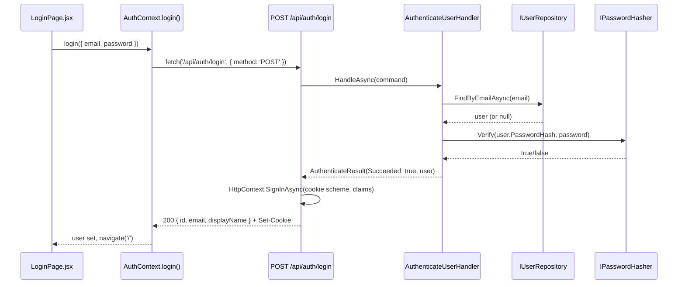

# Implementation Plan: 04 — Log in to an account

## Story

**As a** returning e-Pharmacy customer,
**I want** to log in with my email and password,
**so that** I can access my account and place orders.

Acceptance criteria: see `docs/stories/04-log-in-to-an-account.md`.

## Context

- Builds directly on `docs/implementation-plans/03-sign-up-for-an-account.md`: `User` domain entity, `IPasswordHasher`/`IUserRepository` ports, cookie authentication scheme, `/api/auth/...` namespace, `Endpoints/AuthEndpoints.cs`, `react-router-dom`, `AuthContext`, and the `/signup` route all already exist by the time this story starts.
- `IPasswordHasher` (from plan 03) already exposes both `Hash` and `Verify` — this story only adds a new caller (`AuthenticateUserHandler`), not a new port method.
- Plan 03 deliberately left session rehydration (`GET /api/auth/me`) out of scope and flagged it as this story's concern ("stay logged in across a refresh" is a login/session concept) — this plan picks that up.
- No protected page exists yet anywhere in the frontend (story 03 only added public `/`, `/signup`). This story's "protected-area gating" AC needs *something* to gate — since cart/checkout (stories 07–09) aren't built yet, this plan adds a minimal `/account` page (shows the logged-in user's name/email) purely as the first concrete proof that route-gating works; later stories reuse the same `RequireAuth` wrapper rather than inventing their own.
- OWASP note: login failures must not reveal whether the *email* exists — "wrong password" vs. "no such account" must map to the same generic response, both server-side (one error message) and client-side (one displayed error).

## Approach

`AuthenticateUserHandler` (Application) takes `(email, password)`, looks up the user via the existing `IUserRepository.FindByEmailAsync`, and — whether the user is missing *or* `IPasswordHasher.Verify` fails — returns the same `AuthenticateResult { Succeeded = false }` with no distinguishing detail. The Api's `POST /api/auth/login` endpoint maps any failure to a single generic `401 { message: "Invalid email or password." }`, and on success signs the user in via `HttpContext.SignInAsync` exactly as `POST /api/auth/register` already does (same claims shape), so both endpoints produce an equivalent authenticated cookie session.

`GET /api/auth/me` is added to `AuthEndpoints.cs`: returns `200 { id, email, displayName }` when the cookie identifies a signed-in user (read straight from `HttpContext.User` claims, no repository round-trip needed), or `401` otherwise. `AuthContext` calls this once on mount (`useEffect`) to decide `user`/`loading` before rendering routes, so a page refresh no longer drops the client-side notion of "who's logged in" even though the server-side cookie session was already surviving refreshes.

On the frontend, a `RequireAuth` wrapper (`src/components/RequireAuth.jsx`) checks `useAuth().user` and either renders its children or `<Navigate to="/login" replace />`; while `AuthContext` is still resolving `/api/auth/me` it renders nothing (avoids a login-flash for already-authenticated users). `LoginPage.jsx` mirrors `SignUpPage.jsx`'s shape (form, client-side required-field validation, single generic error message, redirect via `useNavigate()` on success) and is wired at `/login`. The new `/account` route is wrapped in `<RequireAuth>` and simply reads `user` from context to render a welcome message — deliberately minimal, since building out a real account page isn't this story's job.

## Architecture



```csharp
// backend/src/EPharmacy.Application/AuthenticateUserHandler.cs (shape only)
public sealed record AuthenticateUserCommand(string Email, string Password);
public sealed record AuthenticateResult(bool Succeeded, User? User);

public sealed class AuthenticateUserHandler
{
    public Task<AuthenticateResult> HandleAsync(AuthenticateUserCommand command, CancellationToken ct);
}
```

```
frontend/src/
├─ components/
│  └─ RequireAuth.jsx        new — redirects to /login when AuthContext has no user
├─ pages/
│  ├─ LoginPage.jsx           new — '/login' route
│  └─ AccountPage.jsx         new — '/account' route, wrapped in <RequireAuth>
├─ context/AuthContext.jsx    modified — add login(), hydrate user via GET /api/auth/me on mount
└─ App.jsx                    modified — add /login and /account (protected) routes
```

## File Changes

- [ ] `backend/src/EPharmacy.Application/AuthenticateUserHandler.cs` — new handler + `AuthenticateUserCommand`/`AuthenticateResult`
- [ ] `backend/tests/EPharmacy.Application.Tests/AuthenticateUserHandlerTests.cs` — new, written first (TDD), mocks `IUserRepository`/`IPasswordHasher`
- [ ] `backend/src/EPharmacy.Api/Endpoints/AuthEndpoints.cs` — add `POST /api/auth/login` and `GET /api/auth/me`
- [ ] `backend/src/EPharmacy.Api/Program.cs` — DI registration for `AuthenticateUserHandler`
- [ ] `backend/tests/EPharmacy.Api.Tests/AuthEndpointTests.cs` — extend with login/`me` cases
- [ ] `frontend/src/context/AuthContext.jsx` — add `login()`, hydrate `user`/`loading` via `GET /api/auth/me` on mount
- [ ] `frontend/src/components/RequireAuth.jsx` — new
- [ ] `frontend/src/pages/LoginPage.jsx` — new + `LoginPage.test.jsx`
- [ ] `frontend/src/pages/AccountPage.jsx` — new (protected placeholder) + `AccountPage.test.jsx`
- [ ] `frontend/src/App.jsx` — add `/login` route and `/account` route wrapped in `<RequireAuth>`

## Task Breakdown

1. [ ] Write `AuthenticateUserHandlerTests.cs` (red): correct credentials return `Succeeded = true` with the user; unknown email and wrong password both return `Succeeded = false` with no other distinguishing state; `Verify` is not called when the user isn't found. Implement `AuthenticateUserHandler` to go green.
2. [ ] Add `POST /api/auth/login` to `AuthEndpoints.cs`: on success, sign in via `HttpContext.SignInAsync` and return `200`; on failure, return `401 { message: "Invalid email or password." }` regardless of cause.
3. [ ] Add `GET /api/auth/me` to `AuthEndpoints.cs`: `200 { id, email, displayName }` from `HttpContext.User` claims when authenticated, `401` otherwise (add `.RequireAuthorization()` on this route).
4. [ ] Extend `AuthEndpointTests.cs`: login with correct credentials → `200` + cookie; wrong password → `401` with the generic message; unknown email → the same `401`/message; `GET /api/auth/me` returns `401` with no cookie and `200` with one from a prior login.
5. [ ] Extend `AuthContext.jsx`: add `login(payload)`; on mount, call `GET /api/auth/me` and set `user`/`loading` accordingly before children render.
6. [ ] Build `RequireAuth.jsx`: renders nothing while `loading`, `<Navigate to="/login" replace />` when no `user`, otherwise its children.
7. [ ] Build `LoginPage.jsx` (email/password fields, required-field validation, single generic error message on `401`, redirect to `/` via `useNavigate()` on success) + `LoginPage.test.jsx` (validation error, invalid-credentials error, success-then-redirect).
8. [ ] Build `AccountPage.jsx` (reads `user` from `useAuth()`, shows a welcome message) + `AccountPage.test.jsx`; add `/login` and `/account` (wrapped in `<RequireAuth>`) routes to `App.jsx`.
9. [ ] Manually verify protected-area gating: visiting `/account` while logged out redirects to `/login`; logging in then visiting `/account` renders the welcome message.
10. [ ] Full Definition of Done: `dotnet build`/`dotnet test`, `npm run build`/`lint`/`test`, manual smoke test of the full login flow, `node scripts/validate-repository.mjs`.

## Commit Plan

| Tasks | Commit message | Hash |
|-------|-----------------|------|
| 1 | `feat(backend): add AuthenticateUserHandler (TDD)` | |
| 2–4 | `feat(backend): add POST /api/auth/login and GET /api/auth/me` | |
| 5–6 | `feat(frontend): hydrate session via /api/auth/me and add RequireAuth` | |
| 7–8 | `feat(frontend): add login page and protected /account placeholder` | |
| 9–10 | `docs(gen-e2): update story 04 and plan checkboxes` | |

## Acceptance Criteria Mapping

| AC | Task(s) |
|----|---------|
| Login form for returning users | 7 |
| Invalid credentials handled without revealing whether the account exists | 1, 2, 4, 7 |
| Successful login establishes an authenticated session | 2, 5 |
| Protected areas require login | 3, 6, 8, 9 |

## Testing Strategy

| Acceptance criterion | Observable seam | Cheapest proving layer | Approach | Cadence |
|---|---|---|---|---|
| Login succeeds/fails without leaking account existence | `AuthenticateUserHandler` result under mocked ports | Application unit | Test-first (TDD) | Every PR |
| `POST /api/auth/login` / `GET /api/auth/me` status codes | HTTP response via `WebApplicationFactory` | API functional | Test-alongside | Every PR |
| Login form validation, error display, redirect | Rendered DOM under mocked `fetch` | Frontend component | Test-alongside | Every PR |
| Route gating (`/account` redirects when logged out) | Rendered DOM under `MemoryRouter` with a fake `AuthContext` value | Frontend component | Test-alongside | Every PR |
| Full browser login → protected-page journey | Real browser + real backend | Manual smoke | Test-after | Pre-merge manual check only |

## Dependencies

Depends on story 03 (`User` entity, cookie auth scheme, `AuthContext`, routing foundation).

## Open Questions

None outstanding — this plan resolves plan 03's one open question (session rehydration via `/api/auth/me`).
