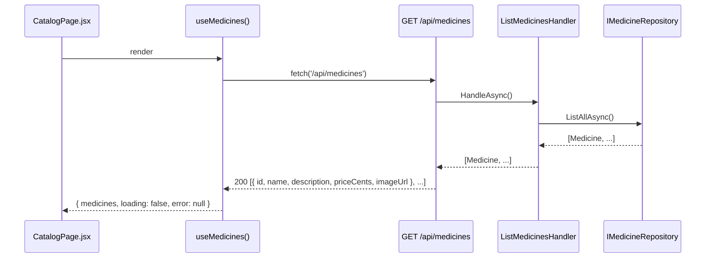

# Implementation Plan: 06 — Browse the medicine catalog with pricing

## Story

**As a** shopper on the e-Pharmacy app,
**I want** to browse the list of available medicines with their prices,
**so that** I can decide what to buy.

Acceptance criteria: see `docs/stories/06-browse-medicine-catalog-with-pricing.md`.

## Context

- First story that isn't about auth. Reuses the layering pattern (`HealthCheck` → `RecordHealthCheckHandler` → `IHealthCheckRepository`, and the equivalent `User` shape from plan 03) for a new `Medicine` aggregate — no repository/handler pattern changes needed.
- `AppDbContext` currently has `HealthChecks` and (after plan 03) `Users`; this story adds a third `DbSet<Medicine>`.
- No products/medicines endpoint exists anywhere yet — this is a purely additive, read-only slice.
- `frontend/src/api/useHealthStatus.js` (existing) is the established convention for a data-fetching hook — a plain hook returning `{ data, loading, error }`-shaped state, no data-fetching library (React Query, SWR, etc.) in use. This story's `useMedicines.js` follows the same shape.
- Plan 03 mapped `/` to a placeholder `HomePage.jsx` explicitly meant to be replaced. This story replaces it: the catalog becomes the app's home page. `HomePage.jsx` is renamed to `CatalogPage.jsx` and `App.jsx`'s `/` route is repointed — the header/`HealthBanner` shell is untouched.
- Money: prices are stored as `PriceCents` (integer, minor units) rather than `decimal` dollars, avoiding floating-point/decimal-rounding pitfalls at the storage layer; the API returns `priceCents` and the frontend is the only place currency formatting happens (`Intl.NumberFormat('en-US', { style: 'currency', currency: 'USD' })` on `priceCents / 100`).
- Since there's no admin/catalog-management story in this epic, sample medicines need to exist somehow. This plan seeds a fixed set of sample medicines at API startup if the table is empty — the same dev-only-convenience spirit as the existing `dbContext.Database.Migrate()` call in `Program.cs`, clearly commented as such.

## Approach

`Medicine` (Domain) is a simple immutable entity — `Id`, `Name`, `Description`, `PriceCents`, `ImageUrl` (nullable) — with a `Create` factory validating non-empty name/description and a non-negative price, mirroring `HealthCheck`'s and `User`'s existing shape. `IMedicineRepository` (Application) exposes one method for this story, `ListAllAsync`, and `ListMedicinesHandler` just delegates to it — there is no business logic to test beyond "the handler returns whatever the repository returns," so its test is intentionally thin (this mirrors how trivial `RecordHealthCheckHandler`'s test already is).

`GET /api/medicines` (new `Endpoints/CatalogEndpoints.cs`, `MapCatalogEndpoints`) is public (no `.RequireAuthorization()` — browsing doesn't require an account; only story 07's *add to cart* does) and returns `200` with an array of `{ id, name, description, priceCents, imageUrl }`. Startup seeding runs in the same `using (var scope = ...)` block in `Program.cs` that already runs `Database.Migrate()`: if `dbContext.Medicines` is empty, insert ~6 fixed sample medicines (common OTC items — pain relievers, allergy medicine, vitamins, etc. — placeholder, non-prescription-sounding names to avoid implying real medical advice) and save.

On the frontend, `CatalogPage.jsx` (renamed from `HomePage.jsx`) uses the new `useMedicines()` hook and renders one of four states — loading, error, empty ("no medicines available"), or a grid of `MedicineCard` components (name, formatted price, description, an `` with `alt={name}` and a broken-image fallback via `onError`). No search/filter/sort UI is built (explicitly out of scope per the story's Notes).

## Architecture



```csharp
// backend/src/EPharmacy.Domain/Medicine.cs (shape only)
public sealed class Medicine
{
    public static Medicine Create(Guid id, string name, string description, int priceCents, string? imageUrl);
    public Guid Id { get; }
    public string Name { get; }
    public string Description { get; }
    public int PriceCents { get; }
    public string? ImageUrl { get; }
}
```

```
frontend/src/
├─ api/
│  └─ useMedicines.js         new — same shape as useHealthStatus.js
├─ pages/
│  └─ CatalogPage.jsx         renamed from HomePage.jsx — real catalog UI
├─ components/
│  └─ MedicineCard.jsx        new
└─ App.jsx                    modified — '/' now renders CatalogPage
```

## File Changes

- [ ] `backend/src/EPharmacy.Domain/Medicine.cs` — new entity + `Create` factory
- [ ] `backend/tests/EPharmacy.Domain.Tests/MedicineTests.cs` — new, written first (TDD)
- [ ] `backend/src/EPharmacy.Application/IMedicineRepository.cs` — new port
- [ ] `backend/src/EPharmacy.Application/ListMedicinesHandler.cs` — new handler
- [ ] `backend/tests/EPharmacy.Application.Tests/ListMedicinesHandlerTests.cs` — new, written first (TDD)
- [ ] `backend/src/EPharmacy.Infrastructure/MedicineRepository.cs` — new, implements `IMedicineRepository`
- [ ] `backend/src/EPharmacy.Infrastructure/AppDbContext.cs` — add `DbSet<Medicine> Medicines` + entity config
- [ ] `backend/src/EPharmacy.Infrastructure/Migrations/*_AddMedicines.cs` — new EF Core migration
- [ ] `backend/src/EPharmacy.Api/Endpoints/CatalogEndpoints.cs` — new, `MapCatalogEndpoints` with `GET /api/medicines`
- [ ] `backend/src/EPharmacy.Api/Program.cs` — DI registrations, dev-only seed-if-empty block alongside the existing migrate block, `app.MapCatalogEndpoints()`
- [ ] `backend/tests/EPharmacy.Api.Tests/CatalogEndpointTests.cs` — new
- [ ] `frontend/src/api/useMedicines.js` — new hook + `useMedicines.test.js`
- [ ] `frontend/src/components/MedicineCard.jsx` — new + `MedicineCard.test.jsx`
- [ ] `frontend/src/pages/HomePage.jsx` → renamed to `frontend/src/pages/CatalogPage.jsx` — real catalog UI + `CatalogPage.test.jsx`
- [ ] `frontend/src/App.jsx` — `/` route renders `CatalogPage`

## Task Breakdown

1. [ ] Write `MedicineTests.cs` (red): `Create` rejects empty name/description, negative `priceCents`, an empty Guid; happy path sets all properties (nullable `imageUrl` allowed). Implement `Medicine.cs` to go green.
2. [ ] Write `ListMedicinesHandlerTests.cs` (red): handler returns exactly what the mocked `IMedicineRepository.ListAllAsync()` returns, including the empty-list case. Implement `IMedicineRepository`, `ListMedicinesHandler` to go green.
3. [ ] Implement `MedicineRepository` against `AppDbContext`; add `DbSet<Medicine> Medicines` + entity configuration; generate the `AddMedicines` migration.
4. [ ] Add the dev-only seed-if-empty block to `Program.cs` (fixed list of ~6 sample medicines with names/descriptions/`priceCents`/`imageUrl`), alongside the existing `Database.Migrate()` call.
5. [ ] Create `Endpoints/CatalogEndpoints.cs` with `MapCatalogEndpoints`: `GET /api/medicines` (no auth required) returning the mapped DTO array; register DI + call `app.MapCatalogEndpoints()` in `Program.cs`.
6. [ ] Write `CatalogEndpointTests.cs`: `GET /api/medicines` returns `200` with a non-empty array whose items have `id`, `name`, `description`, `priceCents` (shape assertion, not tied to specific seed content).
7. [ ] Build `useMedicines.js` (fetches `/api/medicines`, returns `{ medicines, loading, error }`) + test with a mocked `fetch` covering loading/success/error.
8. [ ] Build `MedicineCard.jsx` (name, `Intl.NumberFormat`-formatted price, description, image with `alt` + broken-image fallback) + test.
9. [ ] Rename `HomePage.jsx` → `CatalogPage.jsx`; implement loading/error/empty/list states using `useMedicines()` and `MedicineCard`; write `CatalogPage.test.jsx` covering all four states; update `App.jsx`'s `/` route.
10. [ ] Full Definition of Done: `dotnet build`/`dotnet test`, `npm run build`/`lint`/`test`, manual smoke test (start both apps, confirm the catalog renders seeded medicines with formatted prices), `node scripts/validate-repository.mjs`.

## Commit Plan

| Tasks | Commit message | Hash |
|-------|-----------------|------|
| 1–2 | `feat(backend): add Medicine domain entity and ListMedicinesHandler (TDD)` | |
| 3–4 | `feat(backend): add EF Core persistence and dev seed data for medicines` | |
| 5–6 | `feat(backend): add GET /api/medicines endpoint` | |
| 7–8 | `feat(frontend): add useMedicines hook and MedicineCard` | |
| 9 | `feat(frontend): replace home placeholder with medicine catalog` | |
| 10 | `docs(gen-e2): update story 06 and plan checkboxes` | |

## Acceptance Criteria Mapping

| AC | Task(s) |
|----|---------|
| Catalog lists name, price, description, image per medicine | 8, 9 |
| Data is backend-driven, not hardcoded in the frontend | 3–7, 9 |
| Loading and empty states are handled | 7, 9 |
| Prices are formatted as currency | 8 |

## Testing Strategy

| Acceptance criterion | Observable seam | Cheapest proving layer | Approach | Cadence |
|---|---|---|---|---|
| `Medicine.Create` invariants | Constructed entity / thrown exception | Domain unit | Test-first (TDD) | Every PR |
| `ListMedicinesHandler` delegates to the repository | Handler result under a mocked port | Application unit | Test-first (TDD) | Every PR |
| `GET /api/medicines` shape and status | HTTP response via `WebApplicationFactory` | API functional | Test-alongside | Every PR |
| Catalog page loading/empty/error/list states, price formatting | Rendered DOM under mocked `fetch` | Frontend component | Test-alongside | Every PR |
| Real browser renders seeded catalog correctly | Real browser + real backend | Manual smoke | Test-after | Pre-merge manual check only |

## Dependencies

None on auth — this story is intentionally public/unauthenticated. Depends only on plan 03's routing foundation (`react-router-dom`, `App.jsx` shell) to have somewhere to render.

## Open Questions

- Sample medicine content (names/descriptions/images) is placeholder data invented for this plan — flag for the user to confirm before merging, or replace with real catalog content if available.
