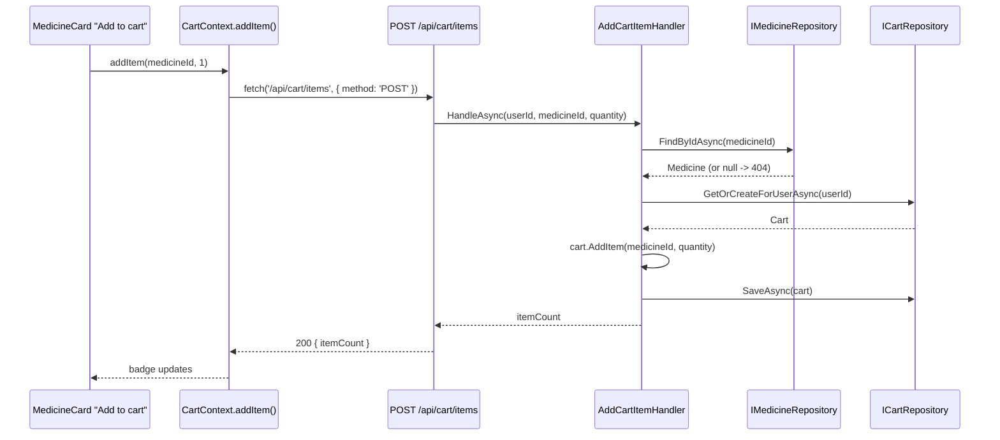

# Implementation Plan: 07 — Add a medicine to the cart

## Story

**As a** logged-in shopper,
**I want** to add a medicine from the catalog to my cart,
**so that** I can buy it later.

Acceptance criteria: see `docs/stories/07-add-medicine-to-cart.md`.

## Context

- First story where "add to cart" is a real business action — reuses the `Medicine` entity from plan 06 and the `User`/cookie-session foundation from plans 03–04.
- `IMedicineRepository` (plan 06) currently only has `ListAllAsync`; this story adds `FindByIdAsync(id)` so the handler can validate the medicine exists before adding it to a cart.
- Story explicitly requires login to add to cart (unlike browsing, which plan 06 kept public) — this is the first `.RequireAuthorization()`-protected *write* endpoint, and the first frontend action that needs to redirect an unauthenticated user to `/login` rather than just gating a whole page (`RequireAuth`, from plan 04, gates entire routes, not a single button — this story adds a narrower, inline check).
- Guest carts are out of scope per the story's own Notes — every cart belongs to exactly one logged-in `User`.

## Approach

`Cart` (Domain) is an aggregate root: one `Cart` per `User`, owning a collection of `CartItem` (`MedicineId`, `Quantity`). `Cart.AddItem(medicineId, quantity)` is the one behavior this story needs — if the medicine is already in the cart, it increments the existing line's quantity; otherwise it appends a new line. This satisfies the AC "adding the same medicine again increases quantity, not duplicate lines" as a Domain invariant, testable without touching Infrastructure. EF Core maps `CartItem` as an *owned* collection of `Cart` (`OwnsMany`) rather than a separately-repository-accessible entity — nothing outside a `Cart` ever needs to load a `CartItem` on its own, so there's no `ICartItemRepository`.

`ICartRepository.GetOrCreateForUserAsync(userId)` returns the user's existing cart or creates (and persists) an empty one the first time — callers never have to special-case "no cart yet." `AddCartItemHandler(userId, medicineId, quantity)` loads the cart, calls `IMedicineRepository.FindByIdAsync(medicineId)` to reject unknown medicines (`404`) before touching the cart, then calls `cart.AddItem(...)` and saves. `POST /api/cart/items` (new `Endpoints/CartEndpoints.cs`, `.RequireAuthorization()`) reads the user id from the authenticated `HttpContext.User`'s `NameIdentifier` claim (set at sign-in in plan 03) — the client never sends a user id.

This story does **not** build the full cart page (that's story 08); it only needs a running item count for the header badge. `GET /api/cart/summary` returns `{ itemCount }` (sum of all line quantities) — deliberately the smallest endpoint that satisfies "cart count" in the AC, not a preview of story 08's full `GET /api/cart`. On the frontend, a new `CartContext` (parallel to `AuthContext`) holds `itemCount` and exposes `addItem(medicineId, quantity)`; it fetches `/api/cart/summary` once `AuthContext` resolves a logged-in `user` (skipped entirely while logged out, since there's nothing to fetch). `MedicineCard`'s new "Add to cart" button checks `useAuth().user` first: if absent, it navigates to `/login` instead of calling the API (no cart action is ever attempted while logged out) — satisfying "requires login" without needing a backend round-trip to find that out.

## Architecture



```csharp
// backend/src/EPharmacy.Domain/Cart.cs (shape only)
public sealed class Cart
{
    public static Cart CreateEmpty(Guid id, Guid userId);
    public Guid Id { get; }
    public Guid UserId { get; }
    public IReadOnlyCollection<CartItem> Items { get; }
    public void AddItem(Guid medicineId, int quantity); // throws for quantity <= 0
    public int TotalItemCount { get; }
}

public sealed record CartItem(Guid MedicineId, int Quantity);
```

```
frontend/src/
├─ context/CartContext.jsx    new — { itemCount, addItem() }
├─ components/MedicineCard.jsx modified — "Add to cart" button, login redirect when logged out
└─ App.jsx                     modified — cart badge in header when logged in
```

## File Changes

- [ ] `backend/src/EPharmacy.Domain/Cart.cs` — new aggregate + `CartItem` + `AddItem`
- [ ] `backend/tests/EPharmacy.Domain.Tests/CartTests.cs` — new, written first (TDD)
- [ ] `backend/src/EPharmacy.Application/IMedicineRepository.cs` — add `FindByIdAsync(Guid id, CancellationToken)`
- [ ] `backend/src/EPharmacy.Application/ICartRepository.cs` — new port (`GetOrCreateForUserAsync`, `SaveAsync`)
- [ ] `backend/src/EPharmacy.Application/AddCartItemHandler.cs` — new handler + result type
- [ ] `backend/tests/EPharmacy.Application.Tests/AddCartItemHandlerTests.cs` — new, written first (TDD)
- [ ] `backend/src/EPharmacy.Infrastructure/MedicineRepository.cs` — implement `FindByIdAsync`
- [ ] `backend/src/EPharmacy.Infrastructure/CartRepository.cs` — new, implements `ICartRepository`
- [ ] `backend/src/EPharmacy.Infrastructure/AppDbContext.cs` — add `DbSet<Cart> Carts`, `OwnsMany` config for `CartItem`
- [ ] `backend/src/EPharmacy.Infrastructure/Migrations/*_AddCarts.cs` — new EF Core migration
- [ ] `backend/src/EPharmacy.Api/Endpoints/CartEndpoints.cs` — new, `MapCartEndpoints` with `POST /api/cart/items` and `GET /api/cart/summary` (both `.RequireAuthorization()`)
- [ ] `backend/src/EPharmacy.Api/Program.cs` — DI registrations, `app.MapCartEndpoints()`
- [ ] `backend/tests/EPharmacy.Api.Tests/CartEndpointTests.cs` — new
- [ ] `frontend/src/context/CartContext.jsx` — new
- [ ] `frontend/src/components/MedicineCard.jsx` — add "Add to cart" button + login redirect
- [ ] `frontend/src/components/MedicineCard.test.jsx` — extend
- [ ] `frontend/src/App.jsx` — cart badge in header (renders `CartContext`'s `itemCount` when logged in), wrap tree in `CartProvider`

## Task Breakdown

1. [ ] Write `CartTests.cs` (red): `AddItem` on an empty cart adds a new line with the given quantity; adding the same `medicineId` again increments quantity instead of duplicating a line; `AddItem` with quantity `<= 0` throws. Implement `Cart.cs`/`CartItem` to go green.
2. [ ] Write `AddCartItemHandlerTests.cs` (red), mocking `IMedicineRepository`/`ICartRepository`: unknown medicine returns a not-found result without touching the cart; known medicine adds/increments and saves, returning the new `itemCount`. Implement `ICartRepository`, `AddCartItemHandler` to go green.
3. [ ] Add `FindByIdAsync` to `IMedicineRepository`/`MedicineRepository`.
4. [ ] Implement `CartRepository`; add `DbSet<Cart> Carts` + `OwnsMany(c => c.Items)` configuration to `AppDbContext`; generate the `AddCarts` migration.
5. [ ] Create `Endpoints/CartEndpoints.cs`: `POST /api/cart/items` (binds `{ medicineId, quantity }`, reads `userId` from the `NameIdentifier` claim, `404` for unknown medicine, `400` for `quantity <= 0`, `200 { itemCount }` on success); `GET /api/cart/summary` (`200 { itemCount }` for the current user). Both `.RequireAuthorization()`.
6. [ ] Write `CartEndpointTests.cs`: adding a known medicine while authenticated returns `200` with the expected `itemCount`; adding the same medicine twice returns an incremented count, not two lines; adding an unknown medicine id returns `404`; calling either endpoint without a session returns `401`.
7. [ ] Build `CartContext.jsx`: fetches `/api/cart/summary` once `AuthContext` resolves a logged-in user (skipped while logged out); `addItem(medicineId, quantity)` posts to `/api/cart/items` and updates `itemCount` from the response.
8. [ ] Add the "Add to cart" button to `MedicineCard.jsx`: if `useAuth().user` is absent, `useNavigate()`s to `/login` instead of calling the API; otherwise calls `useCart().addItem(medicine.id, 1)`. Extend `MedicineCard.test.jsx` for both paths.
9. [ ] Wrap the app tree in `CartProvider` (`App.jsx`) and render the cart badge (`itemCount`) in the header when logged in; extend `App.test.jsx`.
10. [ ] Full Definition of Done: `dotnet build`/`dotnet test`, `npm run build`/`lint`/`test`, manual smoke test (add the same medicine twice while logged in, confirm the badge shows a combined count, not two lines; confirm a logged-out click redirects to `/login`), `node scripts/validate-repository.mjs`.

## Commit Plan

| Tasks | Commit message | Hash |
|-------|-----------------|------|
| 1–2 | `feat(backend): add Cart aggregate and AddCartItemHandler (TDD)` | |
| 3–4 | `feat(backend): add EF Core persistence for carts` | |
| 5–6 | `feat(backend): add POST /api/cart/items and GET /api/cart/summary` | |
| 7–9 | `feat(frontend): add cart context, add-to-cart button, header badge` | |
| 10 | `docs(gen-e2): update story 07 and plan checkboxes` | |

## Acceptance Criteria Mapping

| AC | Task(s) |
|----|---------|
| Add-to-cart action on each catalog item | 8 |
| Cart count is visible (header badge) | 7, 9 |
| Adding the same medicine again increases quantity, not a duplicate line | 1, 2, 6 |
| Adding to cart requires login | 8 |

## Testing Strategy

| Acceptance criterion | Observable seam | Cheapest proving layer | Approach | Cadence |
|---|---|---|---|---|
| `Cart.AddItem` increments vs. adds a new line | Constructed aggregate state | Domain unit | Test-first (TDD) | Every PR |
| Handler validates medicine existence, persists correctly | Handler result under mocked ports | Application unit | Test-first (TDD) | Every PR |
| `POST /api/cart/items` / `GET /api/cart/summary` status codes and auth gating | HTTP response via `WebApplicationFactory` | API functional | Test-alongside | Every PR |
| Add-to-cart button behavior (logged in vs. logged out) | Rendered DOM under mocked context/`fetch` | Frontend component | Test-alongside | Every PR |
| Full browser journey: browse → add → badge updates | Real browser + real backend | Manual smoke | Test-after | Pre-merge manual check only |

## Dependencies

Depends on story 06 (`Medicine` entity, catalog UI) and story 04 (authenticated session, `useAuth`).

## Open Questions

- Guest carts (add to cart before logging in, merge on login) are explicitly out of scope per the story's Notes — flagged again here since it's the most likely follow-up request.
