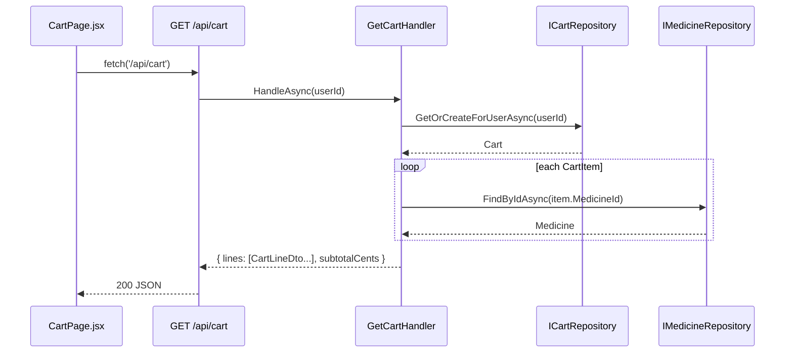

# Implementation Plan: 08 — View and manage the shopping cart

## Story

**As a** logged-in shopper,
**I want** to view my cart and change quantities or remove items,
**so that** I can adjust my order before checking out.

Acceptance criteria: see `docs/stories/08-view-and-manage-shopping-cart.md`.

## Context

- Builds on plan 07's `Cart`/`CartItem` domain model, `ICartRepository`, and `CartEndpoints.cs` (`POST /api/cart/items`, `GET /api/cart/summary`) — this story adds the full cart *view* and mutation endpoints those didn't need.
- `Cart` only stores `MedicineId`/`Quantity` per line, not a name/price snapshot — displaying a cart requires joining each line with `IMedicineRepository` (already has `FindByIdAsync` from plan 07) to get current name/price. Carts are short-lived (pre-checkout), so showing the medicine's *current* price rather than a snapshot is the right behavior here; snapshotting a price only matters once an order is placed (story 09's concern, not this one).
- No cart page exists yet — plan 07 only added a header badge count.

## Approach

`Cart` (Domain) gains two behaviors alongside `AddItem` (from plan 07): `UpdateItemQuantity(medicineId, quantity)` (replaces a line's quantity; throws for an unknown `medicineId`) and `RemoveItem(medicineId)` (idempotent — removing a line that isn't there is a no-op, not an error, since the frontend never needs to distinguish "already removed" from "removed just now"). A new `GetCartHandler(userId)` loads the cart via `ICartRepository`, then — for each line — calls `IMedicineRepository.FindByIdAsync` to build a `CartLineDto { medicineId, name, priceCents, quantity, lineTotalCents }`; the subtotal is the sum of `lineTotalCents`. This is a simple per-line lookup loop rather than a batched query, which is fine at this project's scale (a handful of lines per cart) and keeps `IMedicineRepository`'s surface unchanged.

`UpdateCartItemHandler(userId, medicineId, quantity)` treats `quantity <= 0` as "remove the line" (calls `cart.RemoveItem`) rather than rejecting it — the frontend's quantity stepper can decrement straight to zero without needing a separate "did they mean to remove this?" round trip, and there's exactly one AC ("remove items") this collapses into rather than duplicating. `RemoveCartItemHandler(userId, medicineId)` is the explicit "remove" button's handler. `Endpoints/CartEndpoints.cs` (extended from plan 07) gets `GET /api/cart` (returns `{ lines: [...], subtotalCents }`), `PATCH /api/cart/items/{medicineId}` (body `{ quantity }`), and `DELETE /api/cart/items/{medicineId}` — all `.RequireAuthorization()`.

On the frontend, `CartPage.jsx` (`/cart`, wrapped in `RequireAuth`) fetches `GET /api/cart` directly (full line detail isn't something the header badge needs, so it stays out of the lightweight `CartContext` from plan 07) and renders one of: loading, an empty-cart state ("Your cart is empty" + a link back to `/`), or a table of lines (name, unit price, a quantity stepper, a running line total, a remove button) plus the subtotal. Every mutation (`PATCH`/`DELETE`) re-fetches the cart and also calls `CartContext.refreshCount()` (a new method added to the existing context) so the header badge stays in sync without `CartContext` needing to know about line-level detail.

## Architecture



```csharp
// backend/src/EPharmacy.Domain/Cart.cs (additions, shape only)
public sealed class Cart
{
    // existing: CreateEmpty, Items, AddItem, TotalItemCount
    public void UpdateItemQuantity(Guid medicineId, int quantity); // throws if line not found
    public void RemoveItem(Guid medicineId); // idempotent no-op if not found
}
```

```
frontend/src/
├─ pages/CartPage.jsx          new — '/cart', wrapped in <RequireAuth>
├─ context/CartContext.jsx     modified — add refreshCount()
└─ App.jsx                     modified — add /cart route, link the header badge to it
```

## File Changes

- [ ] `backend/src/EPharmacy.Domain/Cart.cs` — add `UpdateItemQuantity`, `RemoveItem`
- [ ] `backend/tests/EPharmacy.Domain.Tests/CartTests.cs` — extend (TDD)
- [ ] `backend/src/EPharmacy.Application/GetCartHandler.cs` — new + `CartLineDto`/`CartDto`
- [ ] `backend/src/EPharmacy.Application/UpdateCartItemHandler.cs` — new
- [ ] `backend/src/EPharmacy.Application/RemoveCartItemHandler.cs` — new
- [ ] `backend/tests/EPharmacy.Application.Tests/GetCartHandlerTests.cs` — new, written first (TDD)
- [ ] `backend/tests/EPharmacy.Application.Tests/UpdateCartItemHandlerTests.cs` — new, written first (TDD)
- [ ] `backend/src/EPharmacy.Api/Endpoints/CartEndpoints.cs` — add `GET /api/cart`, `PATCH /api/cart/items/{medicineId}`, `DELETE /api/cart/items/{medicineId}`
- [ ] `backend/tests/EPharmacy.Api.Tests/CartEndpointTests.cs` — extend
- [ ] `frontend/src/pages/CartPage.jsx` — new + `CartPage.test.jsx`
- [ ] `frontend/src/context/CartContext.jsx` — add `refreshCount()`
- [ ] `frontend/src/App.jsx` — add `/cart` route (`RequireAuth`), link header badge to `/cart`

## Task Breakdown

1. [ ] Extend `CartTests.cs` (red): `UpdateItemQuantity` replaces an existing line's quantity and throws for an unknown `medicineId`; `RemoveItem` removes an existing line and is a no-op for an unknown one. Implement both methods to go green.
2. [ ] Write `GetCartHandlerTests.cs` (red), mocking both ports: builds `CartLineDto`s from cart items joined with medicine data, computes the correct `subtotalCents`, and returns an empty `lines` array for an empty cart. Implement `GetCartHandler`/DTOs to go green.
3. [ ] Write `UpdateCartItemHandlerTests.cs` (red): `quantity > 0` updates the line; `quantity <= 0` removes it instead. Implement `UpdateCartItemHandler`, `RemoveCartItemHandler` to go green.
4. [ ] Add `GET /api/cart`, `PATCH /api/cart/items/{medicineId}`, `DELETE /api/cart/items/{medicineId}` to `CartEndpoints.cs` (all `.RequireAuthorization()`); register new handlers in `Program.cs`.
5. [ ] Extend `CartEndpointTests.cs`: `GET /api/cart` returns lines + subtotal for a populated cart and an empty array for a new user; `PATCH` updates a quantity; `PATCH` with `quantity: 0` removes the line; `DELETE` removes a line and is safe to call twice.
6. [ ] Add `refreshCount()` to `CartContext.jsx` (re-fetches `/api/cart/summary`).
7. [ ] Build `CartPage.jsx`: loading/empty/populated states, a quantity stepper and remove button per line, running subtotal; every mutation re-fetches the cart and calls `refreshCount()`. Write `CartPage.test.jsx` covering all states plus a quantity-change and a remove interaction.
8. [ ] Add the `/cart` route (`RequireAuth`) to `App.jsx`; make the header cart badge a link to `/cart`.
9. [ ] Full Definition of Done: `dotnet build`/`dotnet test`, `npm run build`/`lint`/`test`, manual smoke test (add two medicines, change a quantity, remove one, confirm the subtotal and header badge both update), `node scripts/validate-repository.mjs`.

## Commit Plan

| Tasks | Commit message | Hash |
|-------|-----------------|------|
| 1–3 | `feat(backend): add cart quantity update/remove behavior and handlers (TDD)` | |
| 4–5 | `feat(backend): add GET/PATCH/DELETE cart endpoints` | |
| 6–8 | `feat(frontend): add cart page with quantity and remove controls` | |
| 9 | `docs(gen-e2): update story 08 and plan checkboxes` | |

## Acceptance Criteria Mapping

| AC | Task(s) |
|----|---------|
| Cart page lists items with name, price, quantity | 7 |
| Quantity can be changed | 1, 3, 4, 5, 7 |
| Items can be removed | 1, 3, 4, 5, 7 |
| Running subtotal is shown and updates | 2, 4, 5, 7 |
| Empty-cart state is handled | 7 |

## Testing Strategy

| Acceptance criterion | Observable seam | Cheapest proving layer | Approach | Cadence |
|---|---|---|---|---|
| `Cart` update/remove invariants | Constructed aggregate state | Domain unit | Test-first (TDD) | Every PR |
| Cart DTO assembly, subtotal math, quantity/remove routing | Handler result under mocked ports | Application unit | Test-first (TDD) | Every PR |
| `GET`/`PATCH`/`DELETE /api/cart...` status codes and payloads | HTTP response via `WebApplicationFactory` | API functional | Test-alongside | Every PR |
| Cart page states, quantity change, remove interaction | Rendered DOM under mocked `fetch` | Frontend component | Test-alongside | Every PR |
| Full browser add → adjust → remove → subtotal journey | Real browser + real backend | Manual smoke | Test-after | Pre-merge manual check only |

## Dependencies

Depends on story 07 (`Cart` aggregate, `ICartRepository`, `CartContext`, header badge).

## Open Questions

None.
