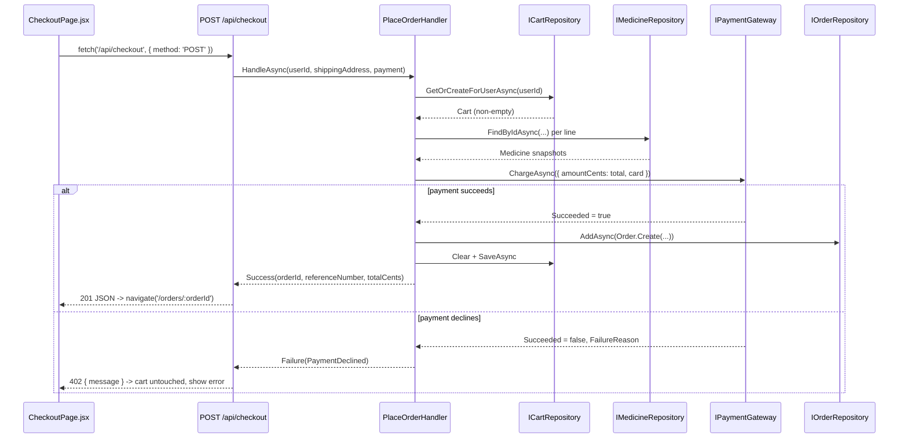

# Implementation Plan: 09 — Checkout with a fake payment and see an order confirmation

## Story

**As a** logged-in shopper with items in my cart,
**I want** to check out, pay (simulated), and see my order confirmed,
**so that** I know my purchase went through.

Acceptance criteria: see `docs/stories/09-checkout-with-fake-payment.md`.

## Context

- Builds on plan 08's `Cart`/`GetCartHandler` (to know what's being bought and its subtotal) and plan 03's authenticated session (to know who's buying).
- Combines "place order" + "fake payment transaction" + "order placed" from the epic's original request into one vertical slice, per the story's own Notes — a real order only exists once payment has (simulated-ly) succeeded, so splitting "place order" from "pay" would create an order that might never be paid for.
- No `Order` concept, no payment abstraction, and no order-confirmation UI exist yet. This story adds all three; story 10 (tracking) will *extend* the same order and the same `/orders/:orderId` page with a status timeline rather than build a separate page.

## Approach

`IPaymentGateway` (Application port) has one method, `ChargeAsync(PaymentRequest)`, returning `PaymentResult { Succeeded, FailureReason }`. `FakePaymentGateway` (Infrastructure) simulates a real payment processor's test-card convention (the same idea Stripe/PayPal sandbox APIs use): every card number succeeds *except* one fixed, documented "always declines" test value (e.g. `4000000000000002`), so the fake payment step is deterministically testable and demoable without needing a real card number to look real. No card data is ever persisted — `PaymentRequest` is constructed in the handler and discarded after the call, satisfying basic PCI-adjacent hygiene (don't store card numbers) even though this is a simulated gateway.

`Order` (Domain) is created only *after* a successful charge: `Order.Create(id, userId, shippingAddress, orderItems, placedAtUtc)`, where each `OrderItem` snapshots `MedicineId`, `Name`, `UnitPriceCents`, and `Quantity` at the moment of purchase (unlike `CartLineDto` in plan 08, which always shows the medicine's *current* price — an order must remain accurate even if the catalog price changes later). `PlaceOrderHandler(userId, shippingAddress, payment)` is the orchestration: load the cart (empty → fail fast, no charge attempted); build order-item snapshots by joining cart lines with `IMedicineRepository` (same join pattern as plan 08's `GetCartHandler`); call `IPaymentGateway.ChargeAsync` for the cart's total; **only on success**, create and persist the `Order` and clear the cart. On a decline, the handler returns a failure result and does not touch the cart or create an order — this is what satisfies the AC "a failed payment leaves the cart intact."

`POST /api/checkout` (new `Endpoints/OrderEndpoints.cs`, `.RequireAuthorization()`) returns `201 { orderId, referenceNumber, totalCents }` on success — `referenceNumber` is the order id's first 8 characters, uppercased, purely for a human-readable confirmation, not a security-sensitive identifier. A declined payment returns `402 Payment Required` with a message (the same status code Stripe-style APIs use for this exact case) rather than `400`, since the request itself was well-formed — payment simply didn't go through. An empty cart returns `400`. `GET /api/orders/{orderId}` (also `.RequireAuthorization()`, and scoped to the calling user — returns `404` for another user's order, not `403`, to avoid confirming the order exists at all) returns the order's items/total/reference/placed-at timestamp; story 10 extends this same response with a status field and history rather than adding a new endpoint.

On the frontend, `CheckoutPage.jsx` (`/checkout`, `RequireAuth`) shows the cart's line items/subtotal (reusing the same `GET /api/cart` data plan 08 already fetches), a shipping-address form, and fake card fields (number/expiry/CVC — client-side format checks only, no real card validation library). Submitting calls `POST /api/checkout`; on success it navigates to `/orders/:orderId` (new `OrderConfirmationPage.jsx`, `RequireAuth`) which shows the reference number, items, and total; on a `402`, the page shows the decline message inline and leaves the form and cart untouched so the shopper can retry (e.g. with a different fake card number).

## Architecture



```csharp
// backend/src/EPharmacy.Domain/Order.cs (shape only)
public sealed class Order
{
    public static Order Create(Guid id, Guid userId, string shippingAddress, IReadOnlyCollection<OrderItem> items, DateTimeOffset placedAtUtc);
    public Guid Id { get; }
    public Guid UserId { get; }
    public string ShippingAddress { get; }
    public IReadOnlyCollection<OrderItem> Items { get; }
    public int TotalCents { get; }
    public DateTimeOffset PlacedAtUtc { get; }
}

public sealed record OrderItem(Guid MedicineId, string Name, int UnitPriceCents, int Quantity);
```

```csharp
// backend/src/EPharmacy.Application/IPaymentGateway.cs (shape only)
public sealed record PaymentRequest(int AmountCents, string CardNumber, string Expiry, string Cvc);
public sealed record PaymentResult(bool Succeeded, string? FailureReason);

public interface IPaymentGateway
{
    Task<PaymentResult> ChargeAsync(PaymentRequest request, CancellationToken ct);
}
```

```
frontend/src/
├─ pages/
│  ├─ CheckoutPage.jsx             new — '/checkout', RequireAuth
│  └─ OrderConfirmationPage.jsx    new — '/orders/:orderId', RequireAuth
└─ App.jsx                         modified — add both routes
```

## File Changes

- [ ] `backend/src/EPharmacy.Domain/Order.cs` — new aggregate + `OrderItem`
- [ ] `backend/tests/EPharmacy.Domain.Tests/OrderTests.cs` — new, written first (TDD)
- [ ] `backend/src/EPharmacy.Application/IPaymentGateway.cs` — new port + `PaymentRequest`/`PaymentResult`
- [ ] `backend/src/EPharmacy.Application/IOrderRepository.cs` — new port
- [ ] `backend/src/EPharmacy.Application/PlaceOrderHandler.cs` — new handler + result type
- [ ] `backend/tests/EPharmacy.Application.Tests/PlaceOrderHandlerTests.cs` — new, written first (TDD)
- [ ] `backend/src/EPharmacy.Infrastructure/FakePaymentGateway.cs` — new, implements `IPaymentGateway`
- [ ] `backend/src/EPharmacy.Infrastructure/OrderRepository.cs` — new, implements `IOrderRepository`
- [ ] `backend/src/EPharmacy.Infrastructure/AppDbContext.cs` — add `DbSet<Order> Orders`, `OwnsMany` config for `OrderItem`
- [ ] `backend/src/EPharmacy.Infrastructure/Migrations/*_AddOrders.cs` — new EF Core migration
- [ ] `backend/src/EPharmacy.Api/Endpoints/OrderEndpoints.cs` — new, `MapOrderEndpoints` with `POST /api/checkout`, `GET /api/orders/{orderId}`
- [ ] `backend/src/EPharmacy.Api/Program.cs` — DI registrations, `app.MapOrderEndpoints()`
- [ ] `backend/tests/EPharmacy.Api.Tests/OrderEndpointTests.cs` — new
- [ ] `frontend/src/pages/CheckoutPage.jsx` — new + `CheckoutPage.test.jsx`
- [ ] `frontend/src/pages/OrderConfirmationPage.jsx` — new + `OrderConfirmationPage.test.jsx`
- [ ] `frontend/src/App.jsx` — add `/checkout` and `/orders/:orderId` routes (both `RequireAuth`)

## Task Breakdown

1. [ ] Write `OrderTests.cs` (red): `Create` computes `TotalCents` from item unit prices × quantities, rejects an empty item collection and an empty shipping address. Implement `Order.cs`/`OrderItem` to go green.
2. [ ] Write `PlaceOrderHandlerTests.cs` (red), mocking `ICartRepository`/`IMedicineRepository`/`IPaymentGateway`/`IOrderRepository`: empty cart fails without calling the payment gateway; a declined payment returns a failure result *and* neither creates an order nor clears the cart; a successful payment creates the order with correct snapshot totals and clears the cart. Implement `IPaymentGateway`, `IOrderRepository`, `PlaceOrderHandler` to go green.
3. [ ] Implement `FakePaymentGateway` (declines only the fixed test card number, succeeds otherwise) and `OrderRepository`; add `DbSet<Order> Orders` + `OwnsMany` config to `AppDbContext`; generate the `AddOrders` migration.
4. [ ] Create `Endpoints/OrderEndpoints.cs`: `POST /api/checkout` (binds shipping address + card fields, `400` for an empty cart or missing fields, `402` for a decline, `201 { orderId, referenceNumber, totalCents }` on success); `GET /api/orders/{orderId}` (`404` if missing or not owned by the caller, otherwise the order's items/total/reference/placed-at).
5. [ ] Write `OrderEndpointTests.cs`: checkout with a non-empty cart and a normal card succeeds and clears the cart (verify via a follow-up `GET /api/cart/summary` returning `itemCount: 0`); checkout with the fixed decline test card returns `402` and leaves the cart populated; checkout with an empty cart returns `400`; fetching another user's order returns `404`.
6. [ ] Build `CheckoutPage.jsx`: shows cart summary (reusing `GET /api/cart`), a shipping-address form, fake card fields with basic format checks; on submit, posts to `/api/checkout`; on `201` navigates to `/orders/:orderId`; on `402` shows the decline message inline, form and cart untouched. Write `CheckoutPage.test.jsx` covering the success and decline paths.
7. [ ] Build `OrderConfirmationPage.jsx`: fetches `GET /api/orders/:orderId`, shows reference number, items, and total. Write `OrderConfirmationPage.test.jsx`.
8. [ ] Add `/checkout` and `/orders/:orderId` routes (both `RequireAuth`) to `App.jsx`.
9. [ ] Full Definition of Done: `dotnet build`/`dotnet test`, `npm run build`/`lint`/`test`, manual smoke test (check out with a normal card → confirmation page with correct total; check out with the fixed decline test card → error shown, cart still has its items), `node scripts/validate-repository.mjs`.

## Commit Plan

| Tasks | Commit message | Hash |
|-------|-----------------|------|
| 1–2 | `feat(backend): add Order aggregate and PlaceOrderHandler (TDD)` | |
| 3 | `feat(backend): add fake payment gateway and order persistence` | |
| 4–5 | `feat(backend): add POST /api/checkout and GET /api/orders/{orderId}` | |
| 6–8 | `feat(frontend): add checkout page and order confirmation page` | |
| 9 | `docs(gen-e2): update story 09 and plan checkboxes` | |

## Acceptance Criteria Mapping

| AC | Task(s) |
|----|---------|
| Checkout flow collects shipping address and shows an order summary | 6 |
| Fake/simulated payment step | 3, 6 |
| Successful payment creates the order and clears the cart | 1, 2, 4, 5 |
| Order-placed confirmation with a reference number | 4, 7 |
| Failed payment preserves the cart | 2, 5, 6 |

## Testing Strategy

| Acceptance criterion | Observable seam | Cheapest proving layer | Approach | Cadence |
|---|---|---|---|---|
| `Order.Create` invariants and total computation | Constructed entity / thrown exception | Domain unit | Test-first (TDD) | Every PR |
| Checkout orchestration (empty cart, decline, success) | Handler result under mocked ports | Application unit | Test-first (TDD) | Every PR |
| `POST /api/checkout` / `GET /api/orders/{orderId}` status codes, cart side effects | HTTP response via `WebApplicationFactory` | API functional | Test-alongside | Every PR |
| Checkout form, success redirect, decline error display | Rendered DOM under mocked `fetch` | Frontend component | Test-alongside | Every PR |
| Full browser cart → checkout → confirmation journey (success and decline) | Real browser + real backend | Manual smoke | Test-after | Pre-merge manual check only |

## Dependencies

Depends on story 08 (`Cart`, `GET /api/cart`) and story 04 (authenticated session).

## Open Questions

- The fixed "always declines" test card number is invented for this plan (documented in code/tests) — confirm this convention is acceptable, or suggest a different way to trigger a simulated failure (e.g. a client-side "simulate failure" toggle) if a hidden test-card number feels too obscure for demo purposes.
