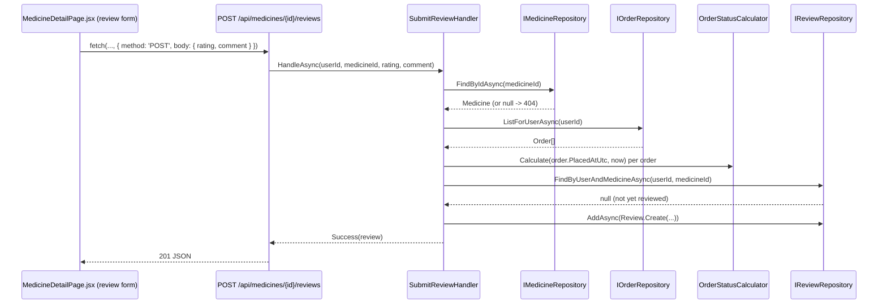

# Implementation Plan: 11 — Submit a product review

## Story

**As a** shopper who has received a medicine,
**I want** to leave a rating and review for it,
**so that** other shoppers can benefit from my experience.

Acceptance criteria: see `docs/stories/11-submit-a-product-review.md`.

## Context

- Builds on plan 06's `Medicine`, plan 03/04's authenticated `User`, and plan 10's `Order`/`OrderStatusCalculator` (used here to decide review *eligibility* — reusing `ListOrdersHandler`'s data rather than adding a bespoke repository query).
- The story's own Notes flag "does a review require a `Delivered` order?" as open. This plan resolves it: **yes** — a shopper may review a medicine only if they have at least one order containing it whose computed status (via `OrderStatusCalculator`, from plan 10) is `Delivered` or later. It does *not* additionally require the manual "Mark as received" click from plan 10 — requiring that extra step before allowing a review is friction the AC doesn't ask for; `Delivered` alone is a reasonable, already-available gate against reviewing something never actually shipped.
- Edit/delete are explicitly out of scope (story Notes). This plan therefore also decides: submitting a second review for the same medicine is rejected with a clear error ("you've already reviewed this item") rather than silently overwriting — since there's no edit flow, allowing silent overwrite-via-resubmit would be a confusing, undocumented way to "edit."
- "Visible on catalog/detail" (AC) needs a place to show more than a single-line summary — there's no per-medicine detail page yet (plan 06 only built a grid of cards). This plan adds the first one: `MedicineDetailPage.jsx` (`/medicines/:medicineId`) with the full review list and (for eligible shoppers) the review form; `MedicineCard` (catalog grid) gets a compact average-rating display and a link into the detail page.
- `IUserRepository` (plan 03) only has `FindByEmailAsync` today; this story adds `FindByIdAsync` so a review can snapshot the reviewer's display name at submission time (avoiding a join on every review read, same snapshot reasoning plan 09 used for order items).

## Approach

`Review` (Domain) is a simple entity — `Id`, `UserId`, `MedicineId`, `ReviewerDisplayName` (snapshotted, not joined live), `Rating` (1–5), `Comment`, `CreatedAtUtc` — with a `Create` factory enforcing the rating range and a non-empty comment. `SubmitReviewHandler(userId, medicineId, rating, comment)` runs three checks before writing anything: the medicine must exist (`IMedicineRepository.FindByIdAsync`, else `404`); the caller must have a `Delivered`-or-later order containing that medicine (loaded via the same `IOrderRepository.ListForUserAsync` plan 10 already introduced, filtered through `OrderStatusCalculator.Calculate`, no new repository method needed); and no existing review from this user for this medicine (`IReviewRepository.FindByUserAndMedicineAsync`). Any failure returns a specific, typed reason (`MedicineNotFound` / `NotEligible` / `AlreadyReviewed`) so the Api layer can map each to the right status code and the frontend can show a precise message.

Because the catalog list (`GET /api/medicines`, plan 06) needs an average rating per medicine, `ListMedicinesHandler` is extended to call a new batched `IReviewRepository.GetRatingSummariesAsync(medicineIds)` (one grouped query, not one query per medicine — avoids an N+1 as the catalog grows) and merge `averageRating`/`reviewCount` into each `MedicineDto`. `GET /api/medicines/{medicineId}/reviews` (new, public — reading reviews doesn't require login, only *writing* one does) returns the full list for the detail page, newest-first.

On the frontend, `MedicineCard` shows a compact star rating + count (from the now-enriched catalog response) and links to `/medicines/:medicineId`. `MedicineDetailPage.jsx` fetches the medicine (reusing the catalog data already in memory when navigated from the grid, or re-fetching the single medicine's fields — kept simple by re-fetching the whole catalog list client-side and finding the matching entry, rather than adding a new single-medicine endpoint solely for this) and the review list, and — only when `useAuth().user` is set — shows a review form. Submitting always attempts the `POST`; a `403`/`409`-mapped eligibility or duplicate-review error is shown inline rather than pre-computed client-side, keeping the eligibility rule server-authoritative (a client-side guess could drift from the real rule and either wrongly hide the form or wrongly promise a submission that then fails).

## Architecture



```csharp
// backend/src/EPharmacy.Domain/Review.cs (shape only)
public sealed class Review
{
    public static Review Create(Guid id, Guid userId, Guid medicineId, string reviewerDisplayName, int rating, string comment, DateTimeOffset createdAtUtc);
    public Guid Id { get; }
    public Guid UserId { get; }
    public Guid MedicineId { get; }
    public string ReviewerDisplayName { get; }
    public int Rating { get; } // 1-5
    public string Comment { get; }
    public DateTimeOffset CreatedAtUtc { get; }
}
```

```
frontend/src/
├─ pages/MedicineDetailPage.jsx   new — '/medicines/:medicineId'
├─ components/MedicineCard.jsx    modified — average rating + link to detail page
└─ App.jsx                        modified — add '/medicines/:medicineId' route
```

## File Changes

- [ ] `backend/src/EPharmacy.Domain/Review.cs` — new entity + `Create` factory
- [ ] `backend/tests/EPharmacy.Domain.Tests/ReviewTests.cs` — new, written first (TDD)
- [ ] `backend/src/EPharmacy.Application/IReviewRepository.cs` — new port
- [ ] `backend/src/EPharmacy.Application/IUserRepository.cs` — add `FindByIdAsync(Guid id, CancellationToken)`
- [ ] `backend/src/EPharmacy.Application/SubmitReviewHandler.cs` — new handler + result type
- [ ] `backend/src/EPharmacy.Application/ListReviewsForMedicineHandler.cs` — new handler
- [ ] `backend/src/EPharmacy.Application/ListMedicinesHandler.cs` — extend to merge rating summaries
- [ ] `backend/tests/EPharmacy.Application.Tests/SubmitReviewHandlerTests.cs` — new, written first (TDD)
- [ ] `backend/tests/EPharmacy.Application.Tests/ListMedicinesHandlerTests.cs` — extend
- [ ] `backend/src/EPharmacy.Infrastructure/ReviewRepository.cs` — new, implements `IReviewRepository`
- [ ] `backend/src/EPharmacy.Infrastructure/UserRepository.cs` — implement `FindByIdAsync`
- [ ] `backend/src/EPharmacy.Infrastructure/AppDbContext.cs` — add `DbSet<Review> Reviews`
- [ ] `backend/src/EPharmacy.Infrastructure/Migrations/*_AddReviews.cs` — new EF Core migration
- [ ] `backend/src/EPharmacy.Api/Endpoints/CatalogEndpoints.cs` — add `GET /api/medicines/{medicineId}/reviews` (public), `POST /api/medicines/{medicineId}/reviews` (`.RequireAuthorization()`)
- [ ] `backend/src/EPharmacy.Api/Program.cs` — DI registrations
- [ ] `backend/tests/EPharmacy.Api.Tests/CatalogEndpointTests.cs` — extend
- [ ] `frontend/src/pages/MedicineDetailPage.jsx` — new + `MedicineDetailPage.test.jsx`
- [ ] `frontend/src/components/MedicineCard.jsx` — add average rating + link; extend `MedicineCard.test.jsx`
- [ ] `frontend/src/App.jsx` — add `/medicines/:medicineId` route

## Task Breakdown

1. [ ] Write `ReviewTests.cs` (red): `Create` rejects a rating outside 1–5, an empty comment, an empty reviewer name; happy path sets all properties. Implement `Review.cs` to go green.
2. [ ] Write `SubmitReviewHandlerTests.cs` (red), mocking all four ports: unknown medicine → `MedicineNotFound`; no `Delivered` order containing the medicine → `NotEligible`; existing review → `AlreadyReviewed`; otherwise persists and returns success. Implement `IReviewRepository`, `IUserRepository.FindByIdAsync`, `SubmitReviewHandler` to go green.
3. [ ] Extend `ListMedicinesHandlerTests.cs` (red): each `MedicineDto` includes `averageRating`/`reviewCount` from a mocked `IReviewRepository.GetRatingSummariesAsync`, defaulting to `0`/`null` when a medicine has no reviews. Implement the extension to go green.
4. [ ] Implement `ReviewRepository` (including the batched `GetRatingSummariesAsync`); implement `UserRepository.FindByIdAsync`; add `DbSet<Review> Reviews` + config; generate the `AddReviews` migration.
5. [ ] Add `GET /api/medicines/{medicineId}/reviews` (public) and `POST /api/medicines/{medicineId}/reviews` (`.RequireAuthorization()`, maps `MedicineNotFound`→`404`, `NotEligible`→`403`, `AlreadyReviewed`→`409`, success→`201`) to `CatalogEndpoints.cs`.
6. [ ] Extend `CatalogEndpointTests.cs`: submitting a review without a qualifying delivered order returns `403`; submitting twice for the same medicine returns `409` the second time; a qualifying submission returns `201` and then appears in `GET /api/medicines/{medicineId}/reviews`; the catalog list (`GET /api/medicines`) reflects the new average rating.
7. [ ] Build `MedicineDetailPage.jsx`: shows the medicine's full description, the review list, and — when logged in — a review form; submission errors (`403`/`409`) are shown inline with the server's message. Write `MedicineDetailPage.test.jsx` covering the logged-out (no form), eligible-submission-success, and ineligible/duplicate-error paths.
8. [ ] Extend `MedicineCard.jsx` with a compact average-rating display and a link to `/medicines/:medicineId`; extend `MedicineCard.test.jsx`.
9. [ ] Add the `/medicines/:medicineId` route to `App.jsx`.
10. [ ] Full Definition of Done: `dotnet build`/`dotnet test`, `npm run build`/`lint`/`test`, manual smoke test (place an order, wait for it to reach `Delivered` per plan 10's thresholds, submit a review, confirm it appears on the detail page and the catalog card's average rating updates), `node scripts/validate-repository.mjs`.

## Commit Plan

| Tasks | Commit message | Hash |
|-------|-----------------|------|
| 1–2 | `feat(backend): add Review entity and SubmitReviewHandler (TDD)` | |
| 3 | `feat(backend): add rating summaries to the catalog list (TDD)` | |
| 4–6 | `feat(backend): add review persistence and endpoints` | |
| 7–9 | `feat(frontend): add medicine detail page with reviews` | |
| 10 | `docs(gen-e2): update story 11 and plan checkboxes` | |

## Acceptance Criteria Mapping

| AC | Task(s) |
|----|---------|
| Review form (rating + text) | 7 |
| Review persisted, associated with user and medicine | 1, 2, 4, 5, 6 |
| Review visible on catalog (rating) and detail (full list) | 3, 6, 7, 8 |
| Basic validation on rating/comment | 1, 5 |

## Testing Strategy

| Acceptance criterion | Observable seam | Cheapest proving layer | Approach | Cadence |
|---|---|---|---|---|
| `Review.Create` invariants | Constructed entity / thrown exception | Domain unit | Test-first (TDD) | Every PR |
| Eligibility/duplicate/not-found handling, rating aggregation | Handler result under mocked ports | Application unit | Test-first (TDD) | Every PR |
| Review endpoints' status codes; catalog reflects new ratings | HTTP response via `WebApplicationFactory` | API functional | Test-alongside | Every PR |
| Detail page form visibility, submission success/error states | Rendered DOM under mocked `fetch` | Frontend component | Test-alongside | Every PR |
| Full browser journey: deliver an order, review it, see it reflected in the catalog | Real browser + real backend | Manual smoke | Test-after | Pre-merge manual check only |

## Dependencies

Depends on story 10 (`Order`, `OrderStatusCalculator`, `ListOrdersHandler`) and story 06 (`Medicine`, catalog UI).

## Open Questions

None — the eligibility rule and duplicate-review handling are resolved above as reasonable defaults; flag if a different eligibility rule (e.g. allowing review right after `Shipped`, or requiring the manual "received" confirmation from plan 10) is preferred.
